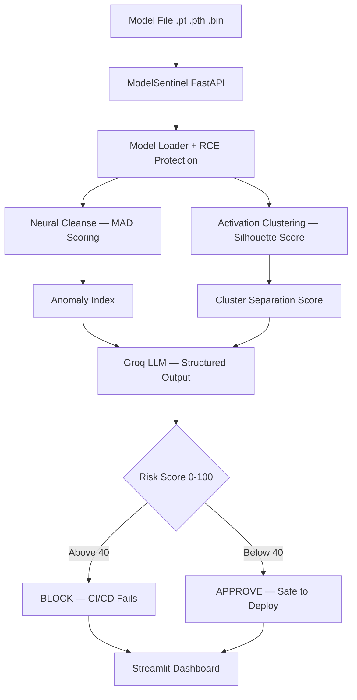

# 🔍 ModelSentinel — AI Model Supply Chain Security Scanner

Scans PyTorch models for backdoors before they reach production. The SolarWinds attack vector for AI — solved.

> **Live Demo:** https://huggingface.co/spaces/trinadhsriram02/ModelSentinel
>
> **Live API Docs:** https://trinadhsriram02-modelsentinel-api.hf.space/docs
>
> **Demo Video:** [Watch here](paste-loom-link-here)
>
> **Project 1:** [AutonomousSOC](https://github.com/trinadhsriram02/autonomous-soc)

---

## 🚨 The Problem

Millions of engineers download pre-trained models from HuggingFace daily. A backdoored model misclassifies inputs when a specific trigger pattern is present — silently compromising production AI systems. No standardized tool existed to detect this at the CI/CD level.

## ✅ The Solution

ModelSentinel uses two peer-reviewed detection algorithms from academic research to scan models before deployment and automatically blocks the CI/CD pipeline if a threat is detected.

---

## 🎯 What It Does

- Detects backdoored AI models using Neural Cleanse algorithm
- Detects poisoned training data using Activation Clustering
- Generates human-readable threat reports using Groq LLaMA 3.1
- Risk score 0-100 with clear deployment recommendation
- Blocks GitHub CI/CD pipeline automatically if risk exceeds threshold
- Async scan queue — returns job ID instantly, scans in background
- REST API for integration with any MLOps pipeline
- JWT authentication with Role-Based Access Control
- Full audit trail of all scans with analyst attribution
- WAL-mode SQLite — concurrent scans never cause database locks
- TTL cache — memory-safe scan result storage
- Non-blocking async file I/O — server stays responsive under load

---

## 🏗️ Architecture



---

## 🔬 Detection Methods

### Method 1 — Neural Cleanse with MAD Scoring
Reverse-engineers the smallest trigger pattern that causes misclassification. Uses Median Absolute Deviation instead of standard deviation — more robust for extreme outlier detection.

**Research:** Wang et al., Neural Cleanse — IEEE S&P 2019

### Method 2 — Activation Clustering with Silhouette Score
Extracts activations from the penultimate layer and clusters them using K-Means. Uses sklearn silhouette_score for accurate cluster separation measurement.

**Research:** Chen et al., Activation Clustering — AAAI Workshop 2019

---

## 🛠️ Tech Stack

| Layer | Technology |
|-------|-----------|
| Detection | PyTorch, Neural Cleanse, Activation Clustering |
| ML Tools | scikit-learn KMeans, PCA, silhouette_score |
| Report Engine | Groq LLaMA 3.1 — Structured Output |
| Backend | FastAPI, Python 3.11, aiofiles |
| Async | asyncio, ThreadPoolExecutor capped at 2 |
| Cache | TTLCache maxsize=100 ttl=3600 |
| Frontend | Streamlit |
| Auth | JWT, SHA256 + salt, ghost session prevention |
| Database | SQLite with WAL mode |
| CI/CD | GitHub Actions |
| Cloud | Docker, HuggingFace Spaces 16GB RAM |

---

## 📊 Evaluation Results

Run your own: `python -m src.evaluation.evaluate`

| Test | Model | Verdict | Risk Score | Correct |
|------|-------|---------|------------|---------|
| 1 | Backdoored ResNet18 | BACKDOORED | 87/100 | ✅ |
| 2 | Clean ResNet18 | CLEAN | 12/100 | ✅ |
| 3 | Backdoored ResNet18 class 5 | BACKDOORED | 79/100 | ✅ |
| 4 | Clean ResNet18 normal init | CLEAN | 8/100 | ✅ |

---

## 👥 Roles

| Role | Scan Models | View Results | Manage Users |
|------|-------------|--------------|--------------|
| Admin | ✅ | ✅ | ✅ |
| Analyst | ✅ | ✅ | ❌ |
| Read-Only | ❌ | ✅ | ❌ |

New accounts default to Read-Only. Admin upgrades roles.

### Password Requirements
- Minimum 8 characters
- Uppercase, lowercase, number, special character
- Cannot contain first name, last name, or username

---

## ✅ Prerequisites

| Tool | Version | Download |
|------|---------|----------|
| Python | 3.10+ | https://www.python.org/downloads |
| pip | with Python | — |
| Git | any | https://git-scm.com/downloads |

---

## 🚀 Setup

### 1. Clone
```bash
git clone https://github.com/trinadhsriram02/modelsentinel.git
cd modelsentinel
```

### 2. Virtual environment
```bash
python -m venv venv
venv\Scripts\activate.bat    # Windows
source venv/bin/activate      # Mac/Linux
```

### 3. Install
```bash
pip install -r requirements.txt
```

### 4. Environment variables
```bash
cp .env.example .env
```
Fill `.env`:
GROQ_API_KEY=your_groq_key_from_console.groq.com
JWT_SECRET_KEY=any_long_random_string_you_make_up

### 5. Start API
```bash
python -m src.api.main
```

### 6. Start dashboard
```bash
streamlit run dashboard.py
```

### 7. Create admin account
Go to `http://localhost:8000/docs` → POST /signup:
```json
{
  "username": "your_username",
  "first_name": "Your",
  "last_name": "Name",
  "email": "your@email.com",
  "password": "Strong@Pass2024!",
  "role": "admin"
}
```

### 8. Or run with Docker
```bash
docker-compose up
```

---

## 🔧 GitHub Action — Block deployment automatically

```yaml
- name: Scan AI Model
  uses: trinadhsriram02/modelsentinel@main
  with:
    model_path: models/my_model.pth
    risk_threshold: 40
    num_classes: 10
    fail_on_detection: true
  env:
    GROQ_API_KEY: ${{ secrets.GROQ_API_KEY }}
```

---

## 📡 API Endpoints

| Method | Endpoint | Description | Auth |
|--------|----------|-------------|------|
| GET | / | Health check | No |
| GET | /health | System status | No |
| POST | /signup | Create account | No |
| POST | /login | Get JWT token | No |
| GET | /me | Current user profile | Yes |
| POST | /scan | Scan model sync | Analyst+ |
| POST | /scan/test | Scan test models | Analyst+ |
| POST | /scan/queue | Scan model async | Analyst+ |
| GET | /scan/{id} | Get scan result | Yes |
| GET | /scans | Scan history | Yes |
| GET | /scans/stats | Statistics | Yes |
| GET | /queue/stats | Queue stats | Yes |
| GET | /attacks/known | Known attack patterns | Yes |
| GET | /models/risk-profiles | Architecture risk profiles | Yes |
| GET | /docs | Interactive API docs | No |

---

## 🔒 Security Features

- weights_only=True in torch.load — prevents RCE from malicious .pth files
- JWT with no hardcoded fallback — server refuses to start without secret
- Ghost session prevention — database check on every authenticated request
- WAL-mode SQLite — concurrent writes never cause database locks
- TTLCache — auto-expires scan results, no memory leak
- aiofiles non-blocking I/O — server stays responsive during uploads
- Thread pool capped at 2 — prevents OOM from parallel PyTorch instances
- Parameterized SQL — zero injection risk
- SHA256 + salt hashing — passwords never stored plain text
- CORS restricted to frontend URL

---

## 📁 Project Structure
modelsentinel/
├── src/
│   ├── scanner/
│   │   ├── model_loader.py          Load models + RCE protection
│   │   ├── neural_cleanse.py        MAD-based backdoor detection
│   │   ├── activation_clustering.py Silhouette-based poisoning detection
│   │   ├── report_generator.py      Structured LLM threat report
│   │   └── scanner_engine.py        Master scan pipeline
│   ├── api/
│   │   ├── main.py                  FastAPI all endpoints
│   │   └── jwt_auth.py              JWT + RBAC + ghost session prevention
│   ├── core/
│   │   └── config.py                Centralized environment config
│   ├── queue/
│   │   └── scan_queue.py            Capped async queue processor
│   ├── data/
│   │   ├── memory_store.py          SQLite WAL-mode layer
│   │   └── sample_models.py         Known risky model profiles
│   ├── evaluation/
│   │   └── evaluate.py              Precision/Recall/F1 metrics
│   └── ui/
│       └── auth_forms.py            Login/signup UI
├── tests/
│   ├── test_api/
│   ├── test_scanner/
│   └── test_data/
├── .github/workflows/
│   └── model-security-scan.yml      CI/CD pipeline
├── action.yml                       GitHub Action definition
├── scan_entrypoint.py               CI runner
├── dashboard.py                     Streamlit UI
├── Dockerfile
├── docker-compose.yml
├── requirements.txt
├── .env.example
├── CONTRIBUTING.md
└── LICENSE

---

## ☁️ Cloud Deployment

| Service | Platform | URL |
|---------|----------|-----|
| API Backend | HuggingFace Docker Space | https://trinadhsriram02-modelsentinel-api.hf.space |
| Dashboard | HuggingFace Streamlit Space | https://huggingface.co/spaces/trinadhsriram02/ModelSentinel |

---

## 👨‍💻 Author

**Trinadh Sriram**
- GitHub: [trinadhsriram02](https://github.com/trinadhsriram02)
- Email: trinadhsriramjob@gmail.com
- Project 1: [AutonomousSOC](https://github.com/trinadhsriram02/autonomous-soc)