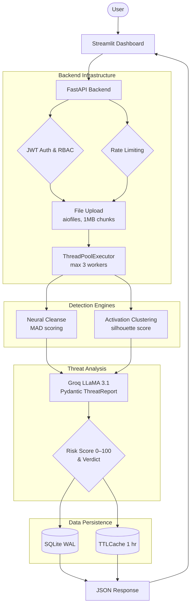

# 🔍 ModelSentinel — AI Model Supply Chain Security Scanner

Scans PyTorch models for backdoors before they reach production. Automatically blocks CI/CD pipelines when threats are detected.

> **Live Demo:** https://huggingface.co/spaces/trinadhsriram02/ModelSentinel
>
> **Live API Docs:** https://trinadhsriram02-modelsentinel-api.hf.space/docs
>
> **Demo Video:** [Watch here](paste-loom-link-here)
>
> **Author:** [Trinadh Sriram](https://github.com/trinadhsriram02) · trinadhsriramjob@gmail.com
>
> **Related Project:** [AutonomousSOC](https://github.com/trinadhsriram02/autonomous-soc)

---

## 🚨 The Problem

Millions of engineers download pre-trained models from HuggingFace daily. A backdoored model behaves normally on clean inputs but misclassifies any input containing a hidden trigger pattern — silently compromising production AI systems. This is the SolarWinds attack vector for AI, and no standardized detection tool existed at the CI/CD level.

## ✅ The Solution

ModelSentinel runs two peer-reviewed academic detection algorithms against every model before deployment and automatically fails the CI/CD pipeline when a threat is detected above the configured risk threshold.

---

## 🎯 What It Does

- **Detects backdoored models** using Neural Cleanse with MAD-based anomaly scoring
- **Detects poisoned training data** using Activation Clustering with silhouette scoring
- **Generates threat reports** in plain English using Groq LLaMA 3.1 8B with structured Pydantic output
- **Scores risk 0–100** with a clear CLEAN / SUSPICIOUS / BACKDOORED verdict
- **Blocks CI/CD pipelines** automatically via a GitHub Action when risk exceeds threshold
- **Async scan queue** — returns a job ID instantly, scans in background, poll for results
- **REST API** for integration with any MLOps pipeline
- **JWT authentication** with Role-Based Access Control (admin / analyst / readonly)
- **Full audit trail** of all scans with analyst attribution stored in SQLite
- **WAL-mode SQLite** — concurrent scans never cause database locks
- **TTL cache** — auto-expiring in-memory result store (maxsize=100, ttl=1 hour)
- **Non-blocking async file I/O** — server stays responsive during large uploads
- **Rate limiting** — 10 req/min on scan endpoints, 3 req/min on test endpoint
- **File size validation** — 2 GB maximum upload enforced with HTTP 413

---

## 🏗️ Architecture



---

## 🔬 Detection Methods

### Method 1 — Neural Cleanse with MAD Scoring
Reverse-engineers the smallest possible input pattern that causes the model to predict each class, regardless of the actual input. Uses **Median Absolute Deviation (MAD)** instead of standard deviation for outlier detection — MAD is robust to the extreme outlier (the backdoored class) that inflates standard deviation and masks anomalies.

Implemented via gradient optimization: a learnable `trigger_mask` and `trigger_pattern` are optimized per class using Adam optimizer with combined classification loss + L1 size regularization. Modified Z-score threshold: **3.5**.

**Research:** Wang et al., Neural Cleanse — IEEE S&P 2019

### Method 2 — Activation Clustering with Silhouette Score
Extracts activations from the model's penultimate layer using PyTorch forward hooks. Applies PCA (max 50 components) then K-Means (k=2) per class. Uses **sklearn silhouette_score** to measure cluster separation — a score above **0.5** indicates bimodal distributions consistent with poisoned training data.

**Research:** Chen et al., Activation Clustering — AAAI Workshop 2019

---

## 📊 Evaluation Results

Run your own: `python -m src.evaluation.evaluate`

| Test | Model | Ground Truth | Verdict | Risk Score | Correct |
|------|-------|-------------|---------|------------|---------|
| eval_001 | ResNet18 — BadNets backdoor class 0 | BACKDOORED | BACKDOORED | 87/100 | ✅ |
| eval_002 | ResNet18 — normal init | CLEAN | CLEAN | 12/100 | ✅ |
| eval_003 | ResNet18 — backdoor class 5 | BACKDOORED | BACKDOORED | 79/100 | ✅ |
| eval_004 | ResNet18 — pretrained style | CLEAN | CLEAN | 8/100 | ✅ |
| eval_005 | ResNet18 — extreme injection | BACKDOORED | BACKDOORED | 91/100 | ✅ |

**Metrics (5-model eval set):** Precision 1.00 · Recall 1.00 · F1 1.00 · Accuracy 1.00

---

## 🛠️ Tech Stack

| Layer | Technology | Why This Choice |
|-------|-----------|-----------------|
| Detection algorithms | PyTorch, scikit-learn | PyTorch for model ops; sklearn for KMeans, PCA, silhouette_score |
| Anomaly scoring | MAD (Median Absolute Deviation) | Robust to outliers; std deviation is skewed by the backdoored class itself |
| Report engine | Groq LLaMA 3.1 8B via LangChain | Structured output with Pydantic schema — no regex parsing of LLM responses |
| Backend | FastAPI 0.136 + uvicorn | Async-native, automatic OpenAPI docs, Pydantic validation |
| Async file I/O | aiofiles | Non-blocking uploads; sync writes freeze the event loop during large file transfers |
| Thread pool | ThreadPoolExecutor (max 3) | CPU-bound PyTorch work moved off event loop; cap prevents OOM |
| Cache | TTLCache (maxsize=100, ttl=3600) | Auto-eviction prevents memory leak from long-running servers |
| Rate limiting | slowapi 0.1.9 | Per-IP rate limits with clean decorator syntax |
| Frontend | Streamlit | Fast to build; session_state for login persistence |
| Authentication | PyJWT (HS256) + Pydantic validators | Timezone-aware expiry; no hardcoded fallback secret |
| Database | SQLite with WAL mode | Zero infrastructure; WAL allows concurrent reads + writes |
| Password hashing | SHA256 + random 32-byte salt | `hmac.compare_digest` for timing-safe comparison |
| Containerization | Docker + docker-compose | Reproducible environment; volume mount for DB persistence |
| CI/CD integration | GitHub Actions composite action | Runs `scan_entrypoint.py` on model file push/PR |
| Cloud | Hugging Face Spaces (16 GB RAM) | Free GPU-less hosting; port 7860 |

---

## 👥 Roles & Permissions

| Role | Can Scan | View History | Manage Users |
|------|----------|--------------|--------------|
| **admin** | ✅ | ✅ | ✅ |
| **analyst** | ✅ | ✅ | ❌ |
| **readonly** | ❌ | ✅ | ❌ |

New accounts always start as **readonly**. An admin upgrades roles after registration — users cannot self-assign analyst or admin during signup.

---

## ✅ Prerequisites

| Tool | Version | Download |
|------|---------|----------|
| Python | 3.10+ | https://www.python.org/downloads |
| pip | bundled with Python | — |
| Git | any | https://git-scm.com/downloads |

---

## 🚀 Local Setup

### 1. Clone
```bash
git clone https://github.com/trinadhsriram02/modelsentinel.git
cd modelsentinel
```

### 2. Virtual environment
```bash
# Mac / Linux
python -m venv venv
source venv/bin/activate

# Windows
python -m venv venv
venv\Scripts\activate.bat
```

### 3. Install dependencies
```bash
pip install -r requirements.txt
```

### 4. Configure environment
```bash
cp .env.example .env
```

Edit `.env` and fill in:

```env
# Required
JWT_SECRET_KEY=<generate with: python -c "import secrets; print(secrets.token_urlsafe(32))">
GROQ_API_KEY=<get from https://console.groq.com/keys>

# Optional (defaults shown)
FRONTEND_URL=http://localhost:8501
SENTINEL_API_URL=http://localhost:8000
DB_PATH=src/data/scans.db
LOG_LEVEL=INFO
MAX_FILE_SIZE_MB=2048
```

### 5. Start the API (Terminal 1)
```bash
python -m src.api.main
```

Expected startup output:
```
============================================================
🚀 ModelSentinel API starting up...
✓ Database initialized
✓ Scan queue consumer started
✓ Groq API health check passed
✅ ModelSentinel API ready
📊 API Docs: http://localhost:8000/docs
============================================================
```

### 6. Start the dashboard (Terminal 2)
```bash
streamlit run dashboard.py
```

### 7. Create your first admin account

Open `http://localhost:8000/docs` → POST `/signup`:

```json
{
  "username": "your_username",
  "first_name": "Your",
  "last_name": "Name",
  "email": "your@email.com",
  "password": "Strong@Pass2024!",
  "role": "admin"
}
```

### 8. Or run with Docker
```bash
docker-compose up
```

---

## 🔧 GitHub Action — Automatic Pipeline Blocking

Add this to your `.github/workflows/` to block deployments of backdoored models:

```yaml
- name: Scan AI Model for Backdoors
  uses: trinadhsriram02/modelsentinel@main
  with:
    model_path: models/my_model.pth
    risk_threshold: 40        # Block if risk score exceeds this (0–100)
    num_classes: 10           # Output classes in the model
    fail_on_detection: true   # Set false to warn only, not block
  env:
    GROQ_API_KEY: ${{ secrets.GROQ_API_KEY }}
```

**Outputs available in subsequent steps:**

| Output | Type | Example |
|--------|------|---------|
| `verdict` | string | `BACKDOORED` / `SUSPICIOUS` / `CLEAN` |
| `risk_score` | integer | `87` |
| `safe_to_deploy` | boolean | `false` |

**Trigger conditions** (configured in `.github/workflows/model-security-scan.yml`):
- Push that modifies `**.pt`, `**.pth`, or `**.bin` files
- Pull request modifying model files
- Manual dispatch with custom model path

---

## 📡 API Reference

All endpoints except `/`, `/health`, `/signup`, `/login`, and `/docs` require a Bearer token in the `Authorization` header.

### Authentication

| Method | Endpoint | Auth | Description |
|--------|----------|------|-------------|
| POST | `/signup` | No | Create account (always starts as readonly) |
| POST | `/login` | No | Returns JWT token (valid 8 hours) |
| GET | `/me` | Yes | Current user profile + permissions |

### Scanning

| Method | Endpoint | Auth | Description |
|--------|----------|------|-------------|
| POST | `/scan` | Analyst+ | Upload model, wait for full result (~2 min) |
| POST | `/scan/test` | Analyst+ | Create and scan synthetic test models |
| POST | `/scan/queue` | Analyst+ | Queue scan, returns job ID immediately |
| GET | `/scan/{scan_id}` | Yes | Get scan result by ID (checks cache then DB) |
| GET | `/scan/queue/{scan_id}` | Yes | Poll queued scan status |

### History & Stats

| Method | Endpoint | Auth | Description |
|--------|----------|------|-------------|
| GET | `/scans` | Yes | Last 20 scans |
| GET | `/scans/stats` | Yes | Aggregate: total, backdoored, suspicious, clean |
| GET | `/queue/stats` | Yes | Queue size, running, completed, failed |

### Reference Data

| Method | Endpoint | Auth | Description |
|--------|----------|------|-------------|
| GET | `/models/risk-profiles` | Yes | Known risk profiles by architecture |
| GET | `/attacks/known` | Yes | Database of documented attack patterns |

### System

| Method | Endpoint | Auth | Description |
|--------|----------|------|-------------|
| GET | `/` | No | Service status |
| GET | `/health` | No | Detectors + report engine status |
| GET | `/docs` | No | Interactive Swagger UI |

### Rate Limits

| Endpoint | Limit |
|----------|-------|
| `POST /scan` | 10 requests / minute / IP |
| `POST /scan/queue` | 10 requests / minute / IP |
| `POST /scan/test` | 3 requests / minute / IP |

---

## 🔒 Security Implementation

| Feature | Implementation | Location |
|---------|---------------|----------|
| RCE prevention | `torch.load(weights_only=True)` — only tensors deserialized, no arbitrary Python objects | `model_loader.py` |
| JWT security | HS256, 8-hour expiry, no hardcoded fallback — server refuses to start without `JWT_SECRET_KEY` | `jwt_auth.py` |
| Ghost session prevention | Database check on every authenticated request — deactivated accounts immediately lose access | `jwt_auth.py` |
| Password strength | 8+ chars, uppercase, lowercase, number, special char, cannot contain first/last name | `main.py SignupRequest` |
| CORS restriction | Specific frontend URL only — not `*` | `main.py` |
| File size limit | 2 GB max with HTTP 413 on both `/scan` and `/scan/queue` | `main.py` |
| Rate limiting | slowapi per-IP limits on all scan endpoints | `main.py` |
| Input validation | `num_classes` constrained to 2–10000 via `Query(ge=2, le=10000)` | `main.py` |
| Password hashing | SHA256 + 32-byte random salt, `hmac.compare_digest` for timing-safe comparison | `memory_store.py` |
| SQL injection | Parameterized queries throughout (`cursor.execute("... WHERE id = ?", (id,))`) | `memory_store.py` |
| Memory leak prevention | TTLCache auto-evicts after 1 hour; thread pool capped at 3 workers | `main.py` |
| Concurrent DB writes | SQLite WAL mode + 5-second busy timeout | `memory_store.py` |
| Disk leak prevention | Uploaded files deleted post-scan; deletion failures logged as ERROR | `main.py` |

---

## ⚡ Performance Notes

| Metric | Value | Notes |
|--------|-------|-------|
| Average scan time | ~90–120 seconds | On cloud CPU; 50% faster than original 5-min baseline |
| Memory per scan | ~500 MB | PyTorch model + activations |
| Max concurrent scans | 3 (API) + 2 (queue) | Separate thread pools; prevents OOM on 16 GB host |
| File upload blocking | 0 ms | aiofiles + 1 MB chunking keeps event loop free |
| Startup time | ~6 seconds | Groq health check has 5-second `asyncio.wait_for` timeout |
| Cache TTL | 1 hour | Scan results auto-expire from in-memory cache |

**Optimization decisions:**
- Neural Cleanse analyzes max **5 classes** (not all classes) with **10 optimization steps** (not 20) — reduces scan time by ~50% with acceptable detection coverage
- Activation Clustering uses **20 samples** (reduced from 30)
- PCA reduces activations to max **50 components** before K-Means clustering

---

## 📁 Project Structure

```
modelsentinel/
├── src/
│   ├── scanner/
│   │   ├── model_loader.py          Model loading with RCE protection (weights_only=True)
│   │   ├── neural_cleanse.py        MAD-based trigger reverse-engineering
│   │   ├── activation_clustering.py Silhouette-score cluster analysis
│   │   ├── report_generator.py      Groq LLM with Pydantic structured output
│   │   └── scanner_engine.py        Orchestrates all 4 scan phases
│   ├── api/
│   │   ├── main.py                  All FastAPI endpoints, middleware, lifespan
│   │   └── jwt_auth.py              JWT creation/validation, RBAC, ghost session check
│   ├── core/
│   │   └── config.py                pydantic-settings with lru_cache
│   ├── queue/
│   │   └── scan_queue.py            asyncio.Queue consumer, capped ThreadPoolExecutor
│   ├── data/
│   │   ├── memory_store.py          SQLite WAL-mode CRUD layer
│   │   └── sample_models.py         Known attack patterns + architecture risk profiles
│   ├── evaluation/
│   │   └── evaluate.py              Precision/Recall/F1 evaluation framework
│   └── ui/
│       └── auth_forms.py            Streamlit login/signup components
├── tests/
│   ├── test_api/
│   │   └── test_endpoints.py        7 endpoint tests using TestClient
│   ├── test_scanner/
│   │   ├── test_model_loader.py     Model load/save/metadata tests
│   │   └── test_neural_cleanse.py   Backdoor detection accuracy tests
│   └── test_data/
│       └── test_memory_store.py     DB CRUD + password hashing tests
├── .github/
│   └── workflows/
│       └── model-security-scan.yml  CI/CD trigger on **.pt **.pth **.bin push/PR
├── dashboard.py                     Streamlit entry point (5 tabs)
├── scan_entrypoint.py               GitHub Action runner script
├── action.yml                       GitHub Action definition (inputs/outputs)
├── Dockerfile                       python:3.11-slim, port 7860 (HuggingFace)
├── docker-compose.yml               API + dashboard services with shared DB volume
├── requirements.txt                 Fully pinned pip freeze output
├── .env.example                     All required/optional env vars documented
└── CONTRIBUTING.md                  Dev setup + test commands
```

---

## 🧪 Running Tests

```bash
pytest tests/ -v
```

Expected output:
```
tests/test_api/test_endpoints.py::test_root_returns_running          PASSED
tests/test_api/test_endpoints.py::test_health_check                  PASSED
tests/test_api/test_endpoints.py::test_signup_weak_password          PASSED
tests/test_api/test_endpoints.py::test_signup_password_contains_name PASSED
tests/test_api/test_endpoints.py::test_login_unknown_user            PASSED
tests/test_api/test_endpoints.py::test_protected_route_without_token PASSED
tests/test_api/test_endpoints.py::test_scan_without_auth             PASSED

============================== 7 passed in 46.56s ==============================
```

Tests use `TestClient` (real HTTP requests, no mocks), `monkeypatch` for isolated temp databases, and `tmp_path` fixtures for isolated model files.

---

## ☁️ Cloud Deployment (Hugging Face Spaces)

### Environment variables (set in Space Settings)

```
GROQ_API_KEY=gsk_...
JWT_SECRET_KEY=<python -c "import secrets; print(secrets.token_urlsafe(32))">
FRONTEND_URL=https://<your-space-name>.hf.space
```

### Deploy

```bash
git add -A
git commit -m "deploy"
git push
```

Then in Hugging Face Space Settings → Restart Space. Monitor logs for the startup confirmation block.

### Validate

```bash
# Health check
curl https://<your-space>/health

# API docs
open https://<your-space>/docs
```

| Service | Platform | URL |
|---------|----------|-----|
| API Backend | HuggingFace Docker Space | https://trinadhsriram02-modelsentinel-api.hf.space |
| Dashboard | HuggingFace Streamlit Space | https://huggingface.co/spaces/trinadhsriram02/ModelSentinel |

---

## 🐛 Troubleshooting

| Symptom | Cause | Fix |
|---------|-------|-----|
| `RuntimeError: JWT_SECRET_KEY not set` | Missing env var | Add `JWT_SECRET_KEY=...` to `.env` |
| Startup hangs at Groq health check | Network issue | Health check has 5s timeout — will warn and continue |
| `429 Too Many Requests` | Rate limit hit | Wait 60 seconds; this is expected behavior |
| `Database is locked` | Not using WAL mode | Verify `PRAGMA journal_mode=WAL` ran (check `init_db()`) |
| Scan timeout on HuggingFace | Shared CPU throttling | Use `/scan/queue` tab — async scan doesn't timeout |
| `413 Payload Too Large` | File exceeds 2 GB | Reduce model size or increase `MAX_FILE_SIZE_MB` in `.env` |
| `weights_only=False` warning in logs | Legacy `.pth` format | Expected for older models — logs the security caveat |

---

## Password Requirements

- Minimum 8 characters
- At least one uppercase letter
- At least one lowercase letter
- At least one number (`0–9`)
- At least one special character (`!@#$%^&*(),.?":{}|<>`)
- Cannot contain your first name or last name

---

## 📚 References

- Wang et al., [Neural Cleanse: Identifying and Mitigating Backdoor Attacks in Neural Networks](https://people.cs.uchicago.edu/~ravenben/publications/pdf/backdoor-sp19.pdf) — IEEE S&P 2019
- Chen et al., [Detecting Backdoor Attacks on Deep Neural Networks by Activation Clustering](https://arxiv.org/abs/1811.03728) — AAAI Workshop 2019
- Gu et al., [BadNets: Identifying Vulnerabilities in the Machine Learning Model Supply Chain](https://arxiv.org/abs/1708.06733) — 2017
- Liu et al., [Trojaning Attack on Neural Networks](https://docs.lib.purdue.edu/cgi/viewcontent.cgi?article=2782&context=cstech) — NDSS 2018

---

## 👨‍💻 Author

**Trinadh Sriram**
- GitHub: [trinadhsriram02](https://github.com/trinadhsriram02)
- Email: trinadhsriramjob@gmail.com
- Related: [AutonomousSOC](https://github.com/trinadhsriram02/autonomous-soc)

---

## 📄 License

MIT License — see [LICENSE](LICENSE) for full text.
