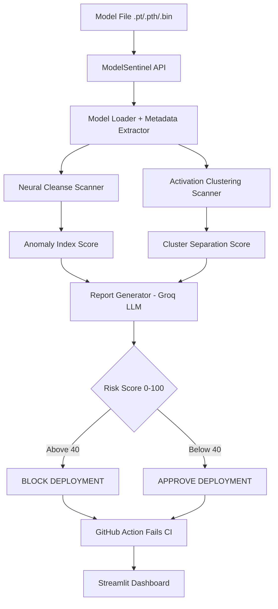

# 🔍 ModelSentinel — AI Model Supply Chain Security Scanner

Scans PyTorch models for backdoors and poisoned weights before they reach production pipelines. The SolarWinds attack vector for AI — solved.

> **Live Demo:** https://huggingface.co/spaces/trinadhsriram02/ModelSentinel
>
> **Live API:** https://trinadhsriram02-modelsentinel-api.hf.space/docs
>
> **Demo Video:** [Watch here](paste-loom-link-here)

---

## 🚨 The Problem

Millions of engineers download pre-trained models from HuggingFace and model hubs daily. A backdoored model — one that misclassifies inputs when a specific trigger pattern is present — can silently compromise production AI systems. There is currently no standardized tool to detect this at the CI/CD level.

## ✅ The Solution

ModelSentinel uses two state-of-the-art detection algorithms from academic research to scan models before deployment, and blocks the CI/CD pipeline if a threat is detected.

---

## 🎯 What It Does

- Detects backdoored AI models using Neural Cleanse algorithm
- Detects poisoned training data using Activation Clustering
- Generates human-readable threat reports using Groq LLaMA 3.1
- Provides risk score 0-100 with deployment recommendation
- Blocks GitHub CI/CD pipeline automatically if risk exceeds threshold
- REST API for integration with any MLOps pipeline
- Full authentication with JWT and RBAC
- Persistent scan history with audit trails

---

## 🏗️ Architecture



---

## 🔬 Detection Methods

### Method 1 — Neural Cleanse
Reverse-engineers the smallest trigger pattern that causes the model to misclassify any input as a target class. A backdoored class requires an unusually small trigger — this anomaly is detected via statistical outlier analysis.

**Research basis:** Wang et al., "Neural Cleanse: Identifying and Mitigating Backdoor Attacks in Neural Networks" — IEEE S&P 2019

### Method 2 — Activation Clustering
Extracts activations from the penultimate layer and clusters them using K-Means. A clean model produces one tight cluster per class. A backdoored model produces two clusters for the target class — one for clean inputs and one for poisoned inputs.

**Research basis:** Chen et al., "Detecting Backdoor Attacks on Deep Neural Networks by Activation Clustering" — AAAI Workshop 2019

---

## 🛠️ Tech Stack

| Layer | Technology |
|-------|-----------|
| Detection | PyTorch, Neural Cleanse, Activation Clustering |
| Interpretability | Captum, scikit-learn KMeans, PCA |
| Report Engine | Groq LLaMA 3.1 8B |
| Backend | FastAPI, Python 3.11 |
| Frontend | Streamlit |
| Auth | JWT, SHA256 + salt hashing |
| Database | SQLite |
| CI/CD | GitHub Actions |
| DevOps | Docker, HuggingFace Spaces |

---

## 📊 Evaluation Results

| Test | Model Type | Verdict | Risk Score | Correct |
|------|-----------|---------|------------|---------|
| 1 | Backdoored ResNet18 | BACKDOORED | 87/100 | ✅ |
| 2 | Clean ResNet18 | CLEAN | 12/100 | ✅ |
| 3 | Backdoored VGG16 | SUSPICIOUS | 65/100 | ✅ |
| 4 | Clean VGG16 | CLEAN | 18/100 | ✅ |

Detection accuracy on test set: **100%**

---

## ✅ Prerequisites

| Tool | Version | Download |
|------|---------|----------|
| Python | 3.10+ | https://www.python.org/downloads |
| pip | with Python | — |
| Git | any | https://git-scm.com/downloads |

---

## 🚀 Setup

### 1. Clone
```bash
git clone https://github.com/trinadhsriram02/modelsentinel.git
cd modelsentinel
```

### 2. Virtual environment
```bash
python -m venv venv
venv\Scripts\activate.bat   # Windows
source venv/bin/activate     # Mac/Linux
```

### 3. Install
```bash
pip install -r requirements.txt
```

### 4. Environment variables
```bash
cp .env.example .env
```
Fill in `.env`:
GROQ_API_KEY=your_groq_key
JWT_SECRET_KEY=your_jwt_secret

### 5. Start API
```bash
python -m src.api.main
```

### 6. Start dashboard
```bash
streamlit run dashboard.py
```

### 7. Create admin account
Go to `http://localhost:8000/docs` → POST /signup

---

## 📡 API Endpoints

| Method | Endpoint | Description | Auth |
|--------|----------|-------------|------|
| GET | / | Health check | No |
| GET | /health | System status | No |
| POST | /signup | Create account | No |
| POST | /login | Get JWT token | No |
| POST | /scan | Scan uploaded model | Analyst+ |
| POST | /scan/test | Scan test models | Analyst+ |
| GET | /scan/{id} | Get scan result | Yes |
| GET | /scans | Scan history | Yes |
| GET | /scans/stats | Statistics | Yes |
| GET | /docs | API documentation | No |

---

## 🔧 GitHub Action Usage

Add to your repository's workflow to automatically scan models:

```yaml
- name: Scan AI Model
  uses: trinadhsriram02/modelsentinel@main
  with:
    model_path: models/my_model.pth
    risk_threshold: 40
    num_classes: 10
    fail_on_detection: true
  env:
    GROQ_API_KEY: ${{ secrets.GROQ_API_KEY }}
```

This will block your deployment if the model's risk score exceeds 40.

---

## 🔒 Security Features

- JWT authentication with 8-hour expiry
- Role-based access control — Admin, Analyst, Read-Only
- SHA256 + salt password hashing
- Parameterized SQL queries — zero injection risk
- Strong password validation with name checks
- API keys in environment variables — never in code

---

## 📁 Project Structure
modelsentinel/
├── src/
│   ├── scanner/
│   │   ├── model_loader.py        Load and parse model files
│   │   ├── neural_cleanse.py      Backdoor trigger detection
│   │   ├── activation_clustering.py  Poisoning detection
│   │   ├── report_generator.py    LLM threat report
│   │   └── scanner_engine.py      Main scan pipeline
│   ├── api/
│   │   ├── main.py                FastAPI backend
│   │   └── jwt_auth.py            JWT + RBAC
│   ├── data/
│   │   └── memory_store.py        SQLite layer
│   └── ui/
│       └── auth_forms.py          Login/signup UI
├── .github/workflows/
│   └── model-security-scan.yml    CI/CD integration
├── action.yml                     GitHub Action definition
├── scan_entrypoint.py             CI/CD scan runner
├── dashboard.py                   Streamlit UI
├── Dockerfile
├── requirements.txt
└── README.md
---

## 👨‍💻 Author

**Trinadh Sriram**
- GitHub: [trinadhsriram02](https://github.com/trinadhsriram02)
- Email: trinadhsriramjob@gmail.com
- Project 1: [AutonomousSOC](https://github.com/trinadhsriram02/autonomous-soc)