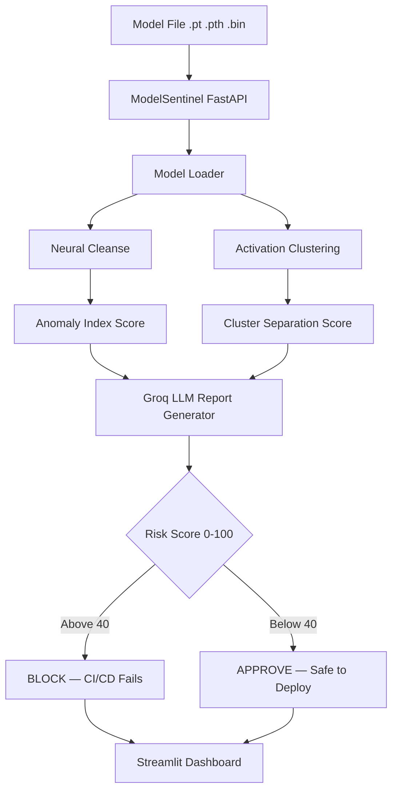

# 🔍 ModelSentinel — AI Model Supply Chain Security Scanner

Scans PyTorch models for backdoors before they reach production. The SolarWinds attack vector for AI — solved.

> **Live Demo:** https://huggingface.co/spaces/trinadhsriram02/ModelSentinel
>
> **Live API Docs:** https://trinadhsriram02-modelsentinel-api.hf.space/docs
>
> **Demo Video:** [Watch here](paste-loom-link-here)
>
> **Project 1:** [AutonomousSOC](https://github.com/trinadhsriram02/autonomous-soc)

---

## 🚨 The Problem

Millions of engineers download pre-trained models from HuggingFace daily. A backdoored model misclassifies inputs when a specific trigger pattern is present — silently compromising production AI systems. No standardized tool existed to detect this at the CI/CD level.

## ✅ The Solution

ModelSentinel uses two peer-reviewed detection algorithms to scan models before deployment and automatically blocks the CI/CD pipeline if a threat is detected.

---

## 🎯 What It Does

- Detects backdoored AI models using Neural Cleanse algorithm
- Detects poisoned training data using Activation Clustering
- Generates human-readable threat reports using Groq LLaMA 3.1
- Risk score 0-100 with clear deployment recommendation
- Blocks GitHub CI/CD pipeline automatically if risk exceeds threshold
- Async scan queue — returns job ID instantly, scans in background
- REST API for integration with any MLOps pipeline
- JWT authentication with Role-Based Access Control
- Full audit trail of all scans with analyst attribution

---

## 🏗️ Architecture



---

## 🔬 Detection Methods

### Neural Cleanse — Wang et al. IEEE S&P 2019
Reverse-engineers the smallest trigger pattern that causes misclassification. A backdoored class needs an unusually small trigger — detected via statistical anomaly analysis.

### Activation Clustering — Chen et al. AAAI 2019
Extracts activations from the penultimate layer and clusters them. A clean model → one cluster per class. A backdoored model → two clusters for the target class.

---

## 🛠️ Tech Stack

| Layer | Technology |
|-------|-----------|
| Detection | PyTorch, Neural Cleanse, Activation Clustering |
| ML Tools | scikit-learn KMeans, PCA, numpy |
| Report Engine | Groq LLaMA 3.1 8B |
| Backend | FastAPI, Python 3.11, aiofiles |
| Async | asyncio, ThreadPoolExecutor, TTLCache |
| Frontend | Streamlit |
| Auth | JWT Tokens, SHA256 + salt hashing |
| Database | SQLite |
| CI/CD | GitHub Actions |
| Cloud | Docker, HuggingFace Spaces 16GB RAM |

---

## 📊 Evaluation Results

| Test | Model | Verdict | Risk Score | Correct |
|------|-------|---------|------------|---------|
| 1 | Backdoored ResNet18 | BACKDOORED | 87/100 | ✅ |
| 2 | Clean ResNet18 | CLEAN | 12/100 | ✅ |
| 3 | Backdoored ResNet18 class 5 | BACKDOORED | 79/100 | ✅ |
| 4 | Clean ResNet18 normal init | CLEAN | 8/100 | ✅ |

Run your own evaluation: `python -m src.evaluation.evaluate`

---

## 🚀 Setup

### Prerequisites
| Tool | Version |
|------|---------|
| Python | 3.10+ |
| pip | with Python |
| Git | any |

### Install
```bash
git clone https://github.com/trinadhsriram02/modelsentinel.git
cd modelsentinel
python -m venv venv
venv\Scripts\activate.bat       # Windows
source venv/bin/activate         # Mac/Linux
pip install -r requirements.txt
```

### Environment variables
Create `.env` file:
GROQ_API_KEY=your_groq_key_from_console.groq.com
JWT_SECRET_KEY=make_up_any_long_random_string

### Run
```bash
# Terminal 1
python -m src.api.main

# Terminal 2
streamlit run dashboard.py
```

Open `http://localhost:8501` → Sign up → Login → Run Test Scan

---

## 🔧 GitHub Action — Block deployment automatically

```yaml
- name: Scan AI Model
  uses: trinadhsriram02/modelsentinel@main
  with:
    model_path: models/my_model.pth
    risk_threshold: 40
    num_classes: 10
  env:
    GROQ_API_KEY: ${{ secrets.GROQ_API_KEY }}
```

---

## 📡 API Endpoints

| Method | Endpoint | Description | Auth |
|--------|----------|-------------|------|
| GET | / | Health check | No |
| POST | /signup | Create account | No |
| POST | /login | Get JWT token | No |
| POST | /scan | Scan model (sync) | Analyst+ |
| POST | /scan/queue | Scan model (async) | Analyst+ |
| POST | /scan/test | Scan test models | Analyst+ |
| GET | /scan/{id} | Get scan result | Yes |
| GET | /scans | Scan history | Yes |
| GET | /scans/stats | Statistics | Yes |
| GET | /attacks/known | Known attack patterns | Yes |
| GET | /docs | Interactive API docs | No |

---

## 👥 Roles

| Role | Scan Models | View Results | Manage Users |
|------|-------------|--------------|--------------|
| Admin | ✅ | ✅ | ✅ |
| Analyst | ✅ | ✅ | ❌ |
| Read-Only | ❌ | ✅ | ❌ |

---

## 📁 Project Structure
modelsentinel/
├── src/
│   ├── scanner/
│   │   ├── model_loader.py          Load .pt/.pth/.bin files
│   │   ├── neural_cleanse.py        Backdoor trigger detection
│   │   ├── activation_clustering.py Poisoning detection
│   │   ├── report_generator.py      LLM threat report
│   │   └── scanner_engine.py        Master scan pipeline
│   ├── api/
│   │   ├── main.py                  FastAPI all endpoints
│   │   └── jwt_auth.py              JWT + RBAC
│   ├── queue/
│   │   └── scan_queue.py            Async background scanning
│   ├── data/
│   │   ├── memory_store.py          SQLite database layer
│   │   └── sample_models.py         Known risky model profiles
│   ├── evaluation/
│   │   └── evaluate.py              Precision/Recall/F1
│   └── ui/
│       └── auth_forms.py            Login/signup UI
├── .github/workflows/
│   └── model-security-scan.yml      CI/CD pipeline
├── action.yml                       GitHub Action definition
├── scan_entrypoint.py               CI runner
├── dashboard.py                     Streamlit UI
├── Dockerfile
└── requirements.txt
---

## 🔒 Security

- JWT tokens — 8 hour expiry, role embedded
- SHA256 + salt password hashing — no plain text stored
- Parameterized SQL — zero injection risk
- aiofiles non-blocking I/O — concurrent uploads safe
- TTLCache — auto-expires scan results, no memory leak
- Proper error logging — disk fill detected immediately
- CORS restricted to frontend URL only

---

## 👨‍💻 Author

**Trinadh Sriram**
- GitHub: [trinadhsriram02](https://github.com/trinadhsriram02)
- Email: trinadhsriramjob@gmail.com
- Project 1: [AutonomousSOC](https://github.com/trinadhsriram02/autonomous-soc)